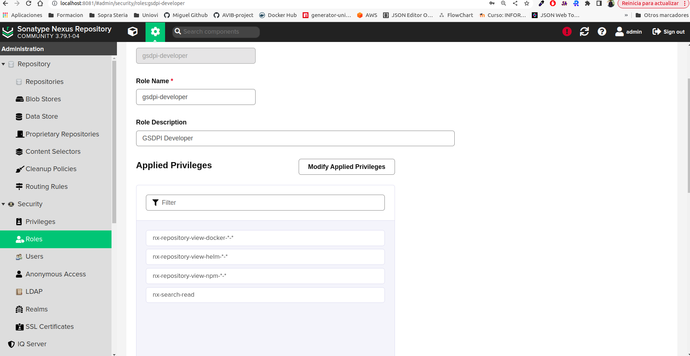

# Description
Documentation about Docker Nexus Deployment

Steps to follow 

## STEP 01: Create Nexus Data Volumne

```
$ docker volume create --name nexus-data
```

## STEP 02: Execute Nexus Container

Nexus supports OCI-format Helm charts, so Helm CLI v3.7+ is needed and you must enable OCI support.
These ports must be opened:

- 8081: Nexus Portal
- 5000: Nexus Docker Registry Repository
  
```
$ docker run -d -p 8081:8081 -p 5000:5000 --name gsdpi-nexus -e HELM_EXPERIMENTAL_OCI=1 -v nexus-data:/nexus-data sonatype/nexus3
```

## STEP 03: Recover default admin password

```
$ docker exec consum-nexus cat /nexus-data/admin.password
26884375-0ba2-4c3f-8a6f-07cac8e6586d
```

## STEP 04: Open Nexus and change default admin password

Sign in as admin with the previous default password and complete the wizard to finalize configuration. Open nexus Portal from your browsert

```
http://localhost:8081/
```

Set new admin password


Nexus portal


## STEP 05: Create and configure repositories

Now we will create our own repositories for:

- Docker Images
- Kubernetes charts
- NPM Packages

Go to Configuration -> Repositories -> Add Respository


This case it's a Docker repository with this configuration:

- Name: gsdpi-docker
- Format: docker
- Type: hosted
- HTTP: 5000
- Allow Anonymous: false

In case Kubernetes charts:

- Name: gsdpi-helm
- Format: helm
- Type: hosted
- Allow Anonymous: false

In case npm packages

- Name: gsdpi-npm
- Format: npm
- Type: hosted
- Allow Anonymous: false

Now we must reopen docker with these new port 5000 for docker. So we must destroy nexus and re-run again with this command. The last configuration will not be destroyed because is saved in a volume:

```
$ docker run -d -p 8081:8081 -p 5000:5000 --name gsdpi-nexus -e HELM_EXPERIMENTAL_OCI=1 -v nexus-data:/nexus-data sonatype/nexus3
```

## STEP 06: exclude your local nexus repository from https docker login

Our default docker CLI uses https connection to login any docker repository, so we must exclude our local nexus service from docker CLI, editing this file **/etc/docker/daemon.json** and adding our local dns: <MY_LOCAL_PUBLIC/PRIVATE_IP>.nip.io:5000 nexus service like this:

```
$ sudo nano /etc/docker/daemon.json
{
     "insecure-registries" : [ "172.30.0.0/16", "<MY_LOCAL_PUBLIC_OR_PRIVATE_IP>.nip.io:5000" ]
}
```

You must restart docker daemon to reconfigure the service like this:

```
$ sudo systemctl restart docker
```
This operation must be execute in all computers in our network where you want access to nexus from http

## STEP 07: creare a rol and user to access to docker nexus repository

Now we are create a role

Go to Nexus configuration -> Roles -> add Role


The configuration for this role is:

- Role Id: gsdpi-developer
- Name: gsdpi-developer
- Description: GSDPI Developer
- Priviledges: nx-repository-view-docker-*-*

Now we are create a user to access to our docker registry

Go to Nexus configuration -> Users -> add User


The configuration for this role is:

- Id: <ID_USERNAME>
- First name: <MY_FIRST_NAME>
- Last name: <MY_LAST_NAME>
- Email: <MY_EMAIL>
- roles available: gsdpi-developer

## STEP 08: login in your new nexus repository
Now nexus is running with all repositories created and configured and your local computer is configured to use a http conection and with a local user with priviledges to pull/push images in gsdpi docker repository. Login inside nexus with the


```
$ docker login <MY_LOCAL_PUBLIC_OR_PRIVATE_IP>.nip.io:5000 -u <ID_USERNAME>
Password:
WARNING! Your password will be stored unencrypted in /root/.docker/config.json.
Configure a credential helper to remove this warning. See
https://docs.docker.com/engine/reference/commandline/login/#credential-stores

Login Succeeded
```
## STEP 09: Push docker image

You must build and tag your image using your nexus <MY_LOCAL_PUBLIC_OR_PRIVATE_IP>.nip.io dns address.

```
$ docker build -t <MY_LOCAL_PUBLIC_OR_PRIVATE_IP>.nip.io:5000/uniovi-gsdpi-bokeh-epigenomics:0.2 .
The push refers to repository [<MY_LOCAL_PUBLIC_OR_PRIVATE_IP>.nip.io:5000/uniovi-gsdpi-bokeh-epigenomics]
188257e1a019: Pushed 
f7cab2190f54: Pushed 
9a9fb8d93b00: Pushed 
e535852bc373: Pushed 
df7e0efe85e6: Pushed 
832ecaad9cb5: Pushed 
7cc0d5f7bb31: Pushed 
ea680fbff095: Pushed 
0.1: digest: sha256:6e415144441b2adf940b8fcceb461616a000e0ca0bd10b0ffaca0d98281fccd5 size: 1999

$ docker push <MY_LOCAL_PUBLIC_OR_PRIVATE_IP>.nip.io:5000/uniovi-gsdpi-bokeh-epigenomics:0.2
```


## STEP 10: Pull docker image
Don't forget configure your **/etc/docker/daemon.json** file and include your <MY_LOCAL_PUBLIC_OR_PRIVATE_IP>.nip.io:5000 dns to use the protocol http for this repository:

```
$ docker pull <MY_LOCAL_PUBLIC_OR_PRIVATE_IP>.nip.io:5000/uniovi-gsdpi-bokeh-epigenomics:0.2
```

## STEP 11: Configure nexus npm repository:

Before publish any npm package in nexus npm repository we must make a post configuration to activate a new npm authentication method used by nexus to authenticate the user when publish any package. This authentication is called: **npm Bear Token Realm method** like this:


## STEP 12: Configure your role and login for npm repository

First we must add a new priviledge to our role **gsdpi-developer** to hava access to the npm repository called **gsdpi-npm**. Go to Configuration -> Roles -> Edit Role **gsdpi-developer** and add this priviledge **nx-repository-view-npm-*-*** like this:


Now we must add our user in the host using the npm CLI like this:

```
$ npm adduser --registry=http://<MY_LOCAL_PUBLIC_OR_PRIVATE_IP>.nip.io:8081/repository/gsdpi-npm/
npm notice Log in on http://<MY_LOCAL_PUBLIC_OR_PRIVATE_IP>:8081/repository/gsdpi-npm/
Username: masalinas
Email: (this IS public) masalinas.gancedo@gmail.com
Logged in on http://<MY_LOCAL_PUBLIC_OR_PRIVATE_IP>:8081/repository/gsdpi-npm/.
```

The configuration is saved in **/home/miguel/.npmr**
## STEP 13: Push the npm package

Inside our npm repository execute this command to publish the npm package:
```
$ npm publish --registry=http://<MY_LOCAL_PUBLIC_OR_PRIVATE_IP>:8081/repository/gsdpi-npm/
username:
password:
email:
```

## STEP 14: Configure your role and login for helm repository

First we must add a new priviledge to our role **gsdpi-developer** to hava access to the npm repository called **gsdpi-helm**. Go to Configuration -> Roles -> Edit Role **gsdpi-developer** and add this priviledge **nx-repository-view-helm-*-*** like this:


Now we must add our helm repository in the host using the helm CLI like this:

```
$ helm repo add gsdpi-helm http://<MY_LOCAL_PUBLIC_OR_PRIVATE_IP>:8081/repository/gsdpi-helm/ --username masalinas
Password: 
```

## STEP 15: Push the helm chart

Inside our helm repository execute this command to publish the helm chart:
```
$ curl -u masalinas --upload-file uniovi-avib-morphingprojections-portal-1.13.0.tgz http://<MY_LOCAL_PUBLIC_OR_PRIVATE_IP>:8081/repository/gsdpi-helm/
```

**NOTE**: if you want use the CLI to push your charts you must configure nexus to use **https** protocol 
```
$ helm push uniovi-avib-morphingprojections-portal-1.13.0.tgz oci://<MY_LOCAL_PUBLIC_OR_PRIVATE_IP>:8081/repository/gsdpi-helm/
```

## STEP 16: manual reindex your charts locally

You must reindex locally your charts from your nexus repository before list them
```
$ helm repo update
```

Now you cant list them
```
$ helm search repo gsdpi-helm
NAME                                             	CHART VERSION	APP VERSION	DESCRIPTION                                       
gsdpi-helm/uniovi-avib-morphingprojections-portal	1.13.0       	1.13.0     	A Helm chart for uniovi-avib-morphingprojection...
```

## STEP 17: Search any artefactory

Nexus offer a general search view to see the artefactors published and some detail about them


Some detail about the artefactor **morphingprojections-portal** version **1.13.0**, for example who if the user that publish this artefactor and when.


## STEP 18: Add permissions for search

To have permissions to search in any repository we must add the permission called **nx-search-read** to the role **gsdpi-developer** like this:



## STEP 19 Bonus: remove some alarms from nexus

Existe an alarm related with some default secret keys that you must update after installation


Generate a new custom secret key:
```
$ openssl rand -base64 32
9Ibw95OCc1kRvEF9VggV4J8wb7/xakKGcHBi3PhOBcU=
```

Download the default nexus configuration file **nexus.properties** from container:
```
$ docker cp gsdpi-nexus:/nexus-data/etc/nexus.properties ./
```

Set the previous secret key value like in this file:
```
# Jetty section
# application-port=8081
# application-host=0.0.0.0
# nexus-args=${jetty.etc}/jetty.xml,${jetty.etc}/jetty-http.xml,${jetty.etc}/jetty-requestlog.xml
# nexus-context-path=/${NEXUS_CONTEXT}

# Nexus section
# nexus-edition=nexus-pro-edition
# nexus-features=\
#  nexus-pro-feature

nexus.security.secretKey=9Ibw95OCc1kRvEF9VggV4J8wb7/xakKGcHBi3PhOBcU=
```

Upload again the configiration to nexus container
```
$ docker cp ./nexus.properties gsdpi-nexus:/nexus-data/etc/nexus.properties
```

Restart nexus the alarm must dispared


## STEP 20 Bonus: set a custom path for nexus

If we are gling to start nexus behinds a proxy like HAProxy, we must to configure a particular path for example **/nexus**. To to that we must edit the
file **nexus.properties** located in **/nexus-data/etc/** and set this key/value inside:

```
nexus-context-path=/nexus
```

Restart nexus the alarm must dispared. Now to access the portal will be:

```
http://localhost:8081/nexus
```

## Links

- [Official Nexus Docker Repository](https://hub.docker.com/r/sonatype/nexus3/)
